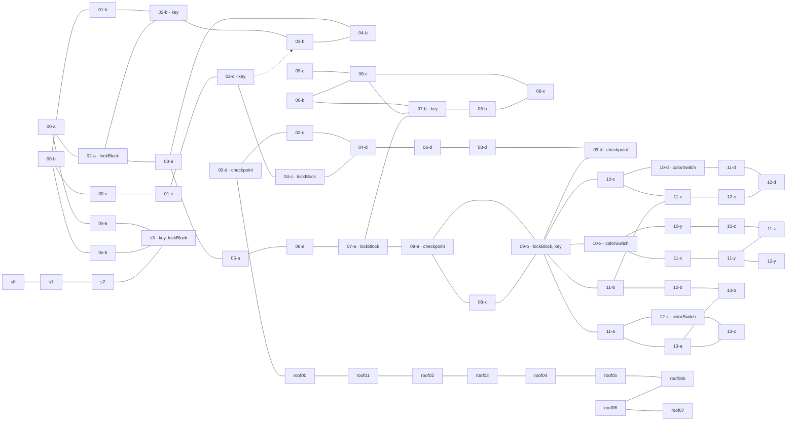

# Celestial Resort → Hooshang school-prison

Phase 1 • 2026-10-05 • A-side only • design research, not copied geometry.

## Evidence and limits

Primary source: the user's installed `3-CelestialResort.bin` at
`/Users/ari/Library/Application Support/Steam/steamapps/common/Celeste/Celeste.app/Contents/Resources/Content/Maps/3-CelestialResort.bin`.
SHA-256: `8e01509417108d2ec589dce5d198780a9b1614f01ef2504b5ba78bc547a42396`.
I decoded its complete node tree, examined solid-cell layouts and entity positions,
and rendered a local structural overview. No Celeste geometry or graphics are
proposed for the shipped level. The other installation is `/Users/ari/Applications/Celeste.app`.

Reproduce the measurements with:

```sh
python3 tools/analyze_celeste_ch3.py '/Users/ari/Library/Application Support/Steam/steamapps/common/Celeste/Celeste.app/Contents/Resources/Content/Maps/3-CelestialResort.bin' --output docs/celeste_ch3_evidence.json
```

The [evidence JSON](celeste_ch3_evidence.json) contains all 65 room IDs, sizes,
platform coordinates, gate records and 76 static boundary candidates. It excludes
tile geometry and art. IDs below omit the binary's `lvl_` prefix.
[Berry Camp's room index](https://berrycamp.github.io/celeste/resort/a) cross-checks
section membership: Start 23 rooms, Huge Mess 23, Elevator Shaft 9,
Presidential Suite 10, including optional rooms. Counts are not mandatory route lengths.

**Confidence:** entity counts and coordinates are measured. Traversal direction,
intended routes and climb exposure below are design readings of those layouts.
This was not an exhaustive controller-driven playthrough of Celeste. A static
empty boundary does not prove a legal transition: entities can seal it, hidden
walls can mask it, and return movement can be impossible. The full graph therefore
separates measured passages from state-dependent routing instead of claiming a
simulation has verified every edge. An exhaustive proof of which jumps *require*
grab would need no-grab play traces; the audit conservatively adapts every relevant
puzzle family rather than asserting that advanced Celeste techniques cannot bypass it.

The brief says Chapter 3 has no water. The binary actually contains **eight `water`
entities** (including laundry/side rooms), but that does not make swimming a core
chapter loop. Hooshang's flooded wing is an original swim puzzle, not a claimed
copy of a Resort swimming challenge.

## Room graph and gates

The graph in the appendix represents every room individually. Here is the
progression reading; labels `K` and `L` refer to keys and locks, not unique colors
in Celeste. Key-to-lock pairings below are inferred from their local routes.

- **Arrival:** `s0 → s1 → s2 → s3` finds a key and lock in `s3` itself, then
  enters `0x-a` (Oshiro's lobby). The upper `0x-b` is a side connection, not
  a second mandatory lobby. Story-controlled `oshirodoor` is separate from keys.
- **First retrieval hub:** `0x-a → 00-a → 02-a`. The lock is in `02-a`;
  its key is above in `02-b`. `02-a ↔ 02-b` is the short mandatory excursion.
  The `01-b / 00-b / 00-c / 0x-b` network expands exploration; do not count
  all of it as required travel to that key. Return to the locked objective.
- **Second retrieval hub:** `03-a → 05-a → 06-a → 07-a` advances to the
  next lock. The key is in `07-b`, reached through the upper route involving
  `06-b`; `06-c`, `05-c`, `08-b`, `08-c` extend that network. The return drop
  from the key vicinity makes coming back shorter than the full excursion.
  `03-a → 04-b` is another side branch.
- **Huge Mess:** `08-a → 09-b` reaches the large cleanup hub. `09-b` contains
  a key AND a lock, plus three colored clutter doors. The key's placement inside
  the clutter-filled hub is not permission to treat it as immediately reachable.
  Three cleanup loops alter the room's available space before progression onward.
  **All color switches and switch-dependent routes are out of scope.**
- **Elevator Shaft:** `09-b → 09-d → 08-d → 06-d → 04-d → 04-c` reaches
  another locked objective. `04-c ↔ 02-c` is the key excursion; return to
  `04-c`, then back through `04-d` to `02-d → 00-d`. `03-b` and `01-c`
  provide optional detours off the key region. The cassette room is `01-c`.
- **Finale:** `00-d → roof00 → roof01 → roof02 → roof03 → roof04 → roof05
  → roof06b → roof06 → roof07`. Note the actual order of `roof06b` before
  `roof06`; alphabetical ordering would be wrong. The rooftop has explicit
  left-edge invisible barriers in `roof01` onward, making it a one-way escalation.
  Hooshang will end with rescue, not reproduce this chase.

### Huge Mess's reusable topology, excluded mechanism

The green loop runs from `09-b` through `10-c → 11-c → 12-c → 12-d →
11-d → 10-d` (green `colorSwitch`) and returns through `10-c`. Red takes
`11-b → 12-b → 13-b → 13-a → 13-x → 12-x` (red switch), returning via
`11-a`. Yellow takes `11-x → 11-y → 11-z → 10-z → 10-y → 10-x` (yellow
switch), returning to the hub. `12-y` is an optional spur. `08-x` and `11-a`
are lower service/secret connections; `11-a` contains the PICO-8 console.
These are intended route readings, conditional on clutter state, not always-open
independent loops. The order changes which clutter remains in other rooms.

Transfer the **recognizable hub + themed excursions + changed return experience**.
Replace the entire cleanup dependency with a wing's single key opening its shortcut.
Do not disguise a cleanup button as a key-shaped switch.

### Exact gate inventory

| Room | Measured entity placement in room pixels | Role |
|---|---|---|
| `s3` | key `(104,240)`; lock `(288,304)` | Local key/door introduction |
| `02-b` / `02-a` | key `(204,140)` / lock `(288,96)` | Retrieve above, return to route |
| `07-b` / `07-a` | key `(232,136)` / lock `(40,88)` | Upper excursion and return |
| `09-b` | key `(320,184)`; lock `(64,24)` | Cleanup hub's onward gate |
| `02-c` / `04-c` | key `(64,120)` / lock `(32,80)` | Long key excursion and retrace |
| `09-b` | Green door `(560,-8)`, Yellow `(592,320)`, Red `(616,72)` | Three state-dependent spoke mouths; excluded |
| `10-d`, `10-x`, `12-x` | Green, Yellow, Red `colorSwitch` respectively | Cleanup terminals; excluded |
| `08-c`, `08-d`, `11-x`, `roof03` | `touchSwitch` + `switchGate` | Additional switch gates; excluded |

Five key entities and five lock entities are measured; Celeste does not label
those keys with our future `KeyId` colors. Fourteen `exitBlock` and eleven
`invisibleBarrier` entities also occur. Exit blocks can close an entry after
passing it; they are not all new key gates. The evidence JSON lists their rooms
and rectangles. The roof barriers provide the clearest explicit one-way examples.

## Puzzle catalog and climb audit

`J` = jump/run; `D` = directional dash; `W` = wall jump; `G` = climb/grab.
“G risk” means an intended safe route may use a hold or climb, not that the binary
alone proves grab is mathematically unavoidable. Every retained family gets a
standing refuge and a no-grab solution; no stamina system is ported.

| ID | Family; reference rooms | Test / source abilities | Climb audit and Hooshang treatment |
|---|---|---|---|
| P1 | Local key above visible lock: `s3`, `02-a/b` | Read goal, leave it, return; J/D/W, possible G | Replace long climb faces with 2–3-tile rises and broad landings. Retain goal preview. |
| P2 | Upper key loop and drop return: `06-b`, `07-b/a` | Route choice and reward return; J/D/W/G risk | Opposed wall-jump faces with rest shelves; key opens safe corridor, no mandatory grab descent. |
| P3 | Long key traverse: `04-c`, `02-c` | Outbound/return planning and dash budgeting; J/D, G risk | Distinct outbound challenge and key-opened return; ground dash resets replace suspended waiting. |
| P4 | Static dust islands and constrained lanes: `00-a`, `02-b`, `04-b` | Landing precision, silhouette reading; J/D/W | G risk if narrow walls are used as waiting points. Add 4-tile solid rests; no wall hang over dust. Library adaptation. |
| P5 | Track/rotating dust cycles: `01-b`, `02-b`, `06-b`, `10-z`, `11-y/z` | Observe, commit, land between cycles; J/D, optional G | Every wait happens on safe floor. Never require holding a wall until a cycle passes. Cafeteria adaptation. |
| P6 | Sinking/crumbling/falling surfaces: `02-a`, `01-b`, `02-c`, `05-c`, `10-z` | Commit before support changes; J/D/W, G risk on falling blocks | Optional later variant only; first prison draft uses static support so key-route failures stay readable. If used, add a permanent landing after each commitment, no riding a grabbed side. |
| P7 | One-way and moving platforms: `02-b`, `05-a`, `08-c` | Approach from below, time transfers; J/D, G risk for side riding | Static one-way ledges retained; replace side-riding with jumps to tops. Moving-support variant deferred. |
| P8 | Vertical shafts / ceiling turns: `s1/s2`, `05-c`, `09-d` | Height gain, wall control; J/W/D/G risk | Alternating wall jumps separated by solid rest shelves; no tall single face requiring climb, no ceiling cling. Gym adaptation. |
| P9 | Trigger spikes / committed passage: `03-a`, `06-a`, `06-d`, `12-y`, roof | Keep moving after touching surface; J/D/W/G risk | Do not port trigger spikes. Use fixed visible hazards and safe wall-jump faces, avoiding “grab then release” timing. |
| P10 | Refill chains: `04-b`, `11-z`, `08-d`, `roof06b` | Dash planning without landing; J/D, sometimes G to align | No refill collectible in prison. End every required dash on ground; split long chains into separate jumps. |
| P11 | Color cleanup loops: `09-b`, `10-d/x`, `12-x` | Multi-route state changes; J/D/W/G along routes | **Out of scope:** switches, clutter clearance and route closures. Keep only loop/hub structure; adapt traversal as P4/P5/P8. |
| P12 | Touch-switch circuits: `08-c/d`, `11-x`, `roof03` | Visit all nodes before gate; J/D/W/G risk | **Out of scope:** no touch switches, gates driven by them, or substitute multi-token task. |
| P13 | Cassette rhythm platforms: `01-c` | Beat timing; J/D/W/G risk | **Out of scope** for initial prison. Wall waiting becomes solid-floor waiting if revisited. |
| P14 | Hidden walls / breakable blocks / secret detours: `00-b`, `0x-b`, `11-a/c` | Exploration and route discovery; J/D/W/G risk | No hidden mandatory keys or smash-to-unlock requirement. Keys and shortcut destinations are advertised openly. |
| P15 | Oshiro roof pursuit and spring sequences: `roof00–07` | Execution under time pressure; J/D/W/G, springs | **Out of scope:** no pursuing boss, spring requirement, or wall-grab pause. Rescue provides the final release. |
| P16 | Optional strawberry commitment routes, heart/PICO detours | Risk/reward; combinations of P4–P14 | No optional progression items. Transfer only readable optional viewpoints, never a required secret. |

Water/swim is **P17, original to this design**, with no claim that Resort teaches
our swim controls. A shallow flooded introduction precedes a submerged route,
with safe pockets and stepped exits; no wall grab, breath meter or underwater dash.

## Pacing and checkpoints

Chapter checkpoints are entities in `08-a` (Huge Mess), `09-d` (Elevator Shaft),
and `00-d` (Presidential Suite). There are also **137 player spawn markers across
65 rooms**; these are not 137 chapter checkpoints. The transferable retry scale is
short room/entry attempts, rather than restarting an entire subchapter at every death.

- Arrival key and lock are in one room. First interior key is one transition
  away from its lock. A small local teaching loop precedes the large hub.
- Between the first interior lock room `02-a` and the next `07-a`, the direct
  spine has three intervening rooms: `03-a`, `05-a`, `06-a`. Optional branches
  make exploration longer without lengthening the critical spine itself.
- Huge Mess's green/red/yellow intended loops each use roughly six rooms outside
  the hub before the cleanup terminal (see explicit paths above), with optional
  detours and state-dependent approaches. This is too much repetition for each
  of four prison keys; shorten to entrance → test → key, then safe return.
- Elevator Shaft starts in `09-d`; four intervening rooms (`08-d`, `06-d`,
  `04-d`, `04-c`) precede the key excursion room `02-c`. Its return revisits the
  objective. The prison should keep the recognizable return but remove repeated
  hard traversal after the reward.
- Suite/roof shifts from exploration to nine roof rooms including the ending.
  We instead lower pressure immediately after the final key and stage the rescue.

Four free-order prison wings cannot guarantee a globally monotonic difficulty
curve. Signage recommends an order; **each wing** guarantees introduce → combine
→ key → relief. Checkpoint every entrance and immediately after pickup, with
additional room-entry retries so a death never repeats a whole wing.

## Measured metrics and transfer constraints

All Celeste measurements below use **8px cells**. These are geometry measurements,
not reach limits for Hooshang. Solid ceiling measurements ignore decorative art.

| Metric | Observed evidence | Prison constraint |
|---|---|---|
| Room size | Median 40×23; 40 of 65 rooms exactly 40×23; eight 80×23 | Base unit 40×24 (320×192), compatible with Hooshang's grid; slight vertical camera travel at 180px viewport height |
| Hub | `09-b` 80×46 | Central hub 80×48; four distinct door pairs, readable landmarks |
| Extended rooms | `02-d` 120×23; `roof06` 254×23; `roof07` 61×110 | Avoid these extremes; one base unit per wing room |
| Platform widths | 96 entities among jumpThru/sinking/crumble/moving: min 1, median 2, max 28 tiles | Required landings ≥4 tiles; waiting shelves ≥5 where momentum matters |
| Stair spacing | `02-b`: platforms `(168,168,w16)`, `(152,152,w16)`, `(192,120,w24)` | Source vertical steps 2 and 4 tiles; adapt rises to 2–3 for reliable Act 2 standing jumps |
| Small moving-support gaps | `06-b`: x=76/140/204, w=24; y=88/96/104 | 5-tile edge gaps, 1-tile stagger. Use 3–4-tile introductory gaps, ≤5 on harder routes |
| Long key traverse gaps | `02-c`: sinking ledges x=184/288/392/496, w=24, y=136 | 10-tile edge gaps in source; **do not transplant**. Break with safe landings; prison mandatory dash gaps ≤6 tiles pending play tests |
| Mixed elevation spacing | `10-z`: lower ledges x=88/176, w=16, y=152; upper x=64/200, y=64 | Lower same-row gap 9 tiles; upper/lower difference 11. Needs intermediate prison shelves, not taller climb faces |
| Ceiling clearance samples | `02-b` platform at x=168,y=168 has solid row 11 above its x-column: 9 clear tiles; x=192,y=120 has solid row 11: 3 clear tiles | Use ≥6 tiles over jump takeoffs; 3–4 only in walk corridors, never above a mandatory high jump |
| Transition apertures | `00-a/02-a`: 3 tiles high; `02-a/02-b`: 4 tiles wide; `00-b/00-c`: 8 wide | Prison side doors ≥4 tiles high; vertical passages ≥4 tiles wide, safe ledge on each side |

These gap/ceiling samples are representative **selected puzzles**, not a fabricated
chapter-wide mean. The JSON preserves platform coordinates and room dimensions so
measurements can be checked independently. Dust radii and entity collisions further
reduce usable space; tile widths alone do not establish safe player clearance.

Hooshang constraints come from current `scripts/act2_beats.gd`,
`scenes/characters/hooshang/player.gd` and `docs/world2-movement-reference.md`:
67.5px/s run cap, momentum-preserving neutral air input, about 32px held standing
jump and 41px running jump in the recorded World 2 trials. Dash nominal travel is
260×0.15=39px before subsequent momentum, not a universal maximum gap. The normal
hitbox is 9×12px. Do not use Act I's old jump+dash rule of thumb as a guarantee.

## Five takeaways

1. Show the imprisoned friend and four locks before offering any branch.
2. Repeat the hub-return rhythm, with one distinct traversal vocabulary per wing.
3. Make earning a key permanently simplify the route home; bank it before danger.
4. Replace every suspended waiting position with a solid standing refuge.
5. Keep retry units small and put the hardest movement before the key, never after it.

## Appendix: complete static room graph

All 65 nodes are actual rooms. `---` means a measured shared solid-grid opening;
it is a **transition candidate**, not a guarantee of both-way traversal. `-.->`
marks the one-cell `02-c/03-b` opening (special/secret clearance, not a normal
body-width passage). Dynamic gates and one-way rules are the overlay described
above. This deliberately does not confuse rectangle adjacency with traversability.


