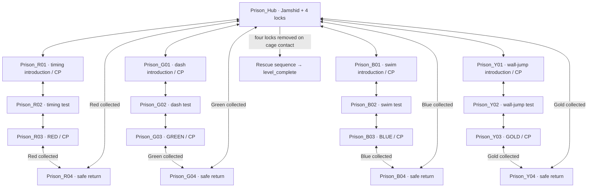

# The school that became a prison

Phase 2 • 2026-10-05 • **Review draft; stop before building**

One continuous rescue mission in `ldtk/hooshang_act2.ldtk`, containing **17 LDtk
rooms**: the central cage hall and four wings of four rooms each. Hooshang sees
Jamshid immediately, explores for four distinct keys, and returns to remove four
locks. Removing the final lock opens the cage, Jamshid walks out, and the mission
fires its completion event. No switches, levers, pressure plates, climbing,
wall-grab, stamina, springs, or additional progression collectibles.

The baseline is the current Act 2 child/momentum profile. We do not change player
physics. “No climb” also means the required routes must pass with land ledge assist
and water-bank mantle unavailable: use jumps that clear ledges and submerged steps
that can be stood on. Those existing assists may remain conveniences, never solutions
required by the geometry. No Ladder entities are allowed.

## Why this structure

[Phase 1](celeste_ch3_analysis.md) identifies two complementary patterns: small
key excursions around visible locked goals (P1–P3), and Huge Mess's recognizable
hub with themed return loops (P11). We retain their spatial structure and remove
all cleanup/switch logic. Four locks on one cage make the destination legible
throughout the mission.

**All four wings are accessible from the start.** Earlier keys do not gate later
wings, so there are no `LockedDoor` instances. This avoids multiplying the state
complexity of Huge Mess and lets a player leave a hard wing and try another.
Signs recommend **Red → Green → Blue → Gold**, but this is a difficulty order,
not a required progression order. Every wing introduces its own mechanic from
safe ground. A key opens only its own return shortcut and its own cage lock.

Each wing has three outbound rooms and one safe return room. Keys are placed on
safe solid ground near the return edge of the third room. Picking one up banks it,
sets the post-key checkpoint, and opens the shortcut in one atomic action. No
second interaction or hidden condition is required. The hard route stays accessible;
there is no trapdoor that forces a player onward before obtaining the key.

## Rooms and adjacency plan

Base unit = **40×24 tiles = 320×192px**, tile size 8px. Hub = **80×48 tiles =
640×384px**, occupying 2×2 units. The extra height beyond the 320×180 viewport is
intentional; wing challenges fit within one camera view wherever possible. The
hub scrolls and uses the cage silhouette and four colored/shape-coded banners
as landmarks. Each room below is one LDtk level; identifiers are stable and
must exactly match the build. They are proposed IDs, not existing rooms.

Coordinates are relative **world-grid units**, with hub top-left at `(0,0)`.
A later build translates the entire cluster to a free Act 2 region on a 320×192
boundary. Do not move or renumber the existing Act 2 rooms to fit this proposal.
The sequence's exact story attachment after existing Act 2 content is a review
choice: default to a dedicated prison entrance transition after `Act_2_Level_13`,
subject to its current exit/story behavior being checked during build.

| LDtk identifier | Tiles | Grid origin | Purpose / core mechanic | Connections |
|---|---:|---:|---|---|
| `Prison_Hub` | 80×48 | (0,0) | Assembly hall; cage, four locks, safe navigation | R01, G01, B01, Y01; returns R04/G04/B04/Y04 once matching key collected |
| `Prison_R01` | 40×24 | (-1,0) | Cafeteria entrance/checkpoint; observe one moving hazard | Hub east; R02 west |
| `Prison_R02` | 40×24 | (-2,0) | Serving hall; two staggered hazard crossings | R01 east; R03 south |
| `Prison_R03` | 40×24 | (-2,1) | Kitchen stores; final timed crossing, **Red key**, checkpoint | R02 north; R04 east, Red required |
| `Prison_R04` | 40×24 | (-1,1) | Staff passage; safe shortcut / relief | R03 west; Hub east, Red required |
| `Prison_G01` | 40×24 | (0,-1) | Library entrance/checkpoint; safe dash alignment | Hub south; G02 north |
| `Prison_G02` | 40×24 | (0,-2) | Reading gallery; dash through offset book-stack lanes | G01 south; G03 east |
| `Prison_G03` | 40×24 | (1,-2) | Archive; final aim test, **Green key**, checkpoint | G02 west; G04 south, Green required |
| `Prison_G04` | 40×24 | (1,-1) | Librarian's stair; safe shortcut | G03 north; Hub south, Green required |
| `Prison_B01` | 40×24 | (1,2) | Basement entrance/checkpoint; shallow swim lesson | Hub north; B02 south |
| `Prison_B02` | 40×24 | (1,3) | Flooded boiler corridor; swim around offset baffles | B01 north; B03 west |
| `Prison_B03` | 40×24 | (0,3) | Pump store; precision swim exit, **Blue key**, checkpoint | B02 east; B04 north, Blue required |
| `Prison_B04` | 40×24 | (0,2) | Dry service stair; safe shortcut | B03 south; Hub north, Blue required |
| `Prison_Y01` | 40×24 | (2,0) | Gym entrance/checkpoint; opposed wall-jump tutorial | Hub west; Y02 east |
| `Prison_Y02` | 40×24 | (3,0) | Equipment hall; short wall-jump chains and rests | Y01 west; Y03 south |
| `Prison_Y03` | 40×24 | (3,1) | Trophy store; wall-jump then dash landing, **Gold key**, checkpoint | Y02 north; Y04 west, Gold required |
| `Prison_Y04` | 40×24 | (2,1) | Changing-room passage; safe shortcut | Y03 east; Hub west, Gold required |

R/G/B/Y abbreviate room IDs in the connections column; Y means Gold, to keep
Gold distinct from Green. The enum values remain `Red, Green, Blue, Gold`.
All listed transitions share a physical edge. Merely touching an unlisted room
edge does not create a door. In particular R01/R04, G01/G04, B01/B04 and Y01/Y04
are adjacent but separated by continuous solid walls: they must not bypass a wing.

`END` is a sequence/event, not an eighteenth LDtk room. Before collecting a key,
both ends of that return corridor are visibly locked with its symbol. Both
`ShortcutDoor` instances reference the same wing key entity; there are still
exactly four progression items, not eight door keys. After collection, every edge
is bidirectional and remains so through death and re-entry. Prevent return-side
access from reaching the key before completing its outbound challenge.

## Hub layout and first impression

Use the former assembly hall with a tiled school crest, barred classroom windows,
and a cage erected on the low central stage. Jamshid can be seen through the bars
before any dialogue. Four distinct locks sit in a row across the door, with
matching symbols: Red triangle, Green leaf, Blue droplet, Gold star. Color is
supplementary, never the only identifier.

The mission enters onto a safe landing in the hub, sets its initial checkpoint,
and frames the cage and “0/4” objective. The first short dialogue establishes only
“four keys, return here.” Door banners identify cafeteria west, library above,
flooded basement below, gym east. A small sign at each entrance shows recommended
difficulty 1–4; no room is physically blocked by that rating.

A broad central floor surrounds the cage. Side galleries and ordinary 2-tile-rise
stairs lead to upper/lower passage mouths. No hazard in the hub, no mandatory
wall-jump to reach a wing entrance, and no inaccessible high platform needed for
rescue. Leave at least 6 tiles of headroom on stair approaches and solid floor
under all interaction/checkpoint points. The cage's walkout side has 6 tiles of
clear floor, outside the player's contact trigger.

## Wing scripts: original geometry, borrowed concepts

Dimensions here are **initial authoring budgets**, to be verified against actual
Act 2 input traces in Phase 4. No coordinate sequence is copied from Celeste.
Mandatory gaps are edge-to-edge, rises are top-to-top, and hazard clearances refer
to collision shapes, not the texture glow.

### 1. Red — cafeteria and kitchen: observe a cycle, then commit

Adapt P1/P5: a visible goal beyond cyclic obstacles, with standing observation
points instead of wall-grab waiting.

- **R01:** one corridor-crossing thought cloud above a recessed broken-floor
  patch. A 5-tile-wide solid shelf before and after it makes waiting safe.
  First gap 3 tiles, destination level with departure. Cloud patrol never touches
  either resting shelf. A safe bypass floor under the first lesson turns the
  first missed jump into practice rather than death.
- **R02:** two 4-tile gaps with a 5-tile central refuge. Patrols are staggered,
  but each can be solved independently by waiting on that refuge. No need to
  memorize a multi-room phase or sprint blindly from spawn. Drop south onto a
  guaranteed safe R03 landing; reciprocal stairs permit retreat.
- **R03:** one final 5-tile gap with a single predictable sweep and a broad
  destination. The Red key is another 4 safe tiles beyond landing, so a dash
  cannot collect it while still crossing the hazard. Open both R04 doors, bank
  the ground checkpoint, show the shortcut banner, then let the player walk east.
- **R04:** hazard-free staff passage to the hub, ≤10 seconds target after pickup.

The clouds are obstacles only; touching/waiting never changes door state. A fixed
cycle starts on room entry for learnable retries, and clouds do not run through
spawn/exit clear zones. Do not reuse behavior that changes after mushrooms or lemons
as a hidden requirement; neither power is needed or supplied here.

### 2. Green — library: aim and land a dash

Adapt P3/P4/P10: constrained routes between hazard regions, breaking refill chains
into grounded segments. Static hazard geometry distinguishes this from Red timing.

- **G01:** teach an up-forward dash from a 5-tile runup across a 4-tile gap to a
  5-tile landing, raised 2 tiles. Failure lands on a safe lower floor. Stairs lead
  to the north transition; there is no grab-only vertical exit.
- **G02:** two staggered book-stack obstacles, each with a visible destination.
  Use 4–5-tile gaps, rises ≤3 tiles and 6+ tiles of launch headroom. The landing
  between them restores the dash through ordinary grounding. Hazards bound the
  route without creating a blind dash into the next camera view.
- **G03:** one 6-tile gap at equal elevation, with the intended trajectory drawn
  by lighting and the far shelf in view. If current movement clears it too easily
  without dash, adjust overhead obstruction/landing position within the measured
  reach budget; never make the gap larger just to enforce the input. Green key
  and checkpoint sit on an 8-tile archive floor after the last hazard.
- **G04:** librarian's stairs descend to the hub; no hazard, dash, or wall jump
  needed on the return. Safe jumps back up remain possible once opened.

No dash crystals, rhythm blocks, breakable-door progression or hidden key behind
books. The key is visible from the final safe launch point.

### 3. Blue — flooded basement: controlled swimming and exits

Original P17, using Resort's excursion/return rhythm rather than claiming a water
puzzle was ported. Water is always a traversable region, never an unlock state;
there is no drain, valve, pump activation, timer or breath resource.

- **B01:** dry checkpoint, then a shallow pool with a visible lower submerged
  step. Enter by walking/falling. Up/down steering and neutral buoyancy can be
  practiced with no hazards. A dry-side sign makes clear that dash is unavailable
  underwater. The south seam sits in a broad safe flooded opening.
- **B02:** submerged 4-tile-wide passages bend around two floor/ceiling baffles.
  Maintain ≥4 tiles clear height too. One stationary hazard patch on each *outer*
  bend rewards braking before turning, not pixel-perfect threading. Safe alcoves
  separate turns; no moving hazard shares a tight swim channel. The west seam
  enters B03 through hazard-free water, with a stable surface definition on both
  sides so a seam cannot eject the player from SWIM.
- **B03:** a short upward swim through a 5-tile-wide shaft reaches an open pool.
  A submerged stair rises in 1-tile steps to a dry 8-tile shelf. Author it so
  ordinary support/exit-swim behavior works with bank mantle disabled; test that
  exact recipe. Blue key is on the dry shelf, never at an oscillating waterline.
- **B04:** a dry service stair returns north to the hub. Separate it from B01
  with a solid wall so it cannot become a pre-key alternate entrance.

Air pockets are visual/resting landmarks, not oxygen necessities. No fish or
water machinery are mechanically required. Painted water fits irregular shapes;
no new buoyancy physics is needed.

### 4. Gold — gym and equipment stores: wall jumps with rest ledges

Adapt P2/P8: short height-gain sequences followed by a key-return loop. This is
the hardest wing because it combines wall-jump direction changes and landing,
not because it demands a longer stamina hold.

- **Y01:** two opposed clean faces, initially 3 tiles apart, with a broad rescue
  floor underneath and a landing shelf 3 tiles up. Teach jump-away from contact;
  there are no hazard-coated walls or climb controls to discover.
- **Y02:** two separate short alternating-wall sections, each raising the route
  at most 6 tiles overall and split by a ≥5-tile standing shelf. Begin with
  3–4-tile face spacing, validate actual wall-jump horizontal travel, and widen
  as necessary without increasing the height demand. At most two successive
  wall jumps before a rest; no single uninterrupted towering wall.
- **Y03:** a final wall-jump release into an up-forward or horizontal dash onto a
  6-tile-wide floor, across at most a 5-tile gap. Hazards sit below the route,
  never on the launch faces. Gold key and post-key checkpoint sit beyond this
  landing; no final precision drop after pickup.
- **Y04:** a flat changing-room passage with easy stairs to the hub. Hard outbound
  sequences can be retried later, but key owners never need to repeat them.

No wall-grab wait, neutral climb exploit, one-cell squeeze, ladder, spring,
moving wall or auto-mantle dependency. If a sequence needs any of those, change
its geometry rather than the controller.

## Checkpoints, key state and rescue contract

- Every wing entrance has a checkpoint on solid dry ground, before its first
  obstacle. Every key has a post-key checkpoint on its safe floor. Add safe
  room-entry retries for test/key rooms; hardest sequences start after that rest.
  The hub checkpoint updates on return so a later hub death cannot send the
  player back through a wing. Baseline: 9 required checkpoints (hub + 8), plus
  room-entry anchors, with key-room anchor replaced by its post-key location.
- Store `collected_keys` and `inserted_keys` independently in a mission-scoped
  state owner that survives room changes and player respawns. Key collection is
  idempotent by KeyId. `reset_all` must not restore collected keys or close their
  shortcuts. Do not use an active room's temporary flags as mission authority.
- On pickup, validate the safe anchor, bank the key and anchor together, then
  update HUD and doors. A death in that frame cannot lose the key or respawn in
  a hazard. Reconstruct key visibility/door collision from state on every entry.
- **Cage input choice: contact.** Touching the clearly marked front approach
  inserts all carried, uninserted keys in Red/Green/Blue/Gold order. Each matching
  lock disappears visibly, with a brief tick and ~0.2s stagger. No new interact
  binding. A key is remembered as collected even after insertion; shortcuts
  depend on collection, so insertion never closes them.
- HUD has four fixed symbols, with empty, carried, and inserted states. “3/4
  found” remains separate from “2/4 locks opened” if keys have not yet been banked
  at the cage. Shape + fill + label provide redundant information.
- The fourth key pickup alone does **not** complete the mission. Returning to
  cage contact and removing the fourth lock sets `rescue_started` once, pauses
  normal player input, opens the door (~0.5s), walks Jamshid onto the clear stage
  (~1.5s), then emits `prison_completed`/the project's level-complete hook once.
  Camera framing and a brief line may add ~1s. Total target 3–4 seconds.
- Skipping the sequence applies the same final open-cage/Jamshid-outside state
  and emits once. Keep the cage approach hazard-free. Repeated contact while
  animating, death callbacks, re-entry and loading cannot duplicate completion.
- Minimum requested persistence is across death within the mission. Proposed
  build also serializes both key sets, checkpoint room/anchor and completion
  status into existing slot saves, so Quit/Continue does not erase the rescue.
  That is a localized save-schema extension, not a save-system redesign.

## LDtk and Godot integration plan for Phase 3

**No LDtk or runtime edits are made in this review phase.** The inspected project
uses LDtk JSON **1.5.3**, `Free` layout, world grid 640×352, and 14 existing levels.
Actual level sizes vary considerably; the proposed unit is a prison constraint,
not a claim that all current Act 2 rooms are already 40×24.

1. **Preserve existing Act 2 content.** Bootstrap/append the prison rooms with a
   script such as `tools/build_prison_ldtk.py`, preserving every unrelated IID,
   UID, layer definition and entity. Allocate new UIDs above the current maximum;
   use stable IIDs and resolve `ShortcutDoor` EntityRefs to keys in this project.
   Script reruns must refuse to overwrite hand-edited prison rooms without an
   explicit rebuild option and backup. The saved LDtk remains the editable source.
2. **Grid:** use 320×192 world-grid increments for this cluster. If a global grid
   setting changes, existing room coordinates remain unchanged. Do not force
   already-authored irregular Act 2 rooms into a new grid layout. Keep Free layout
   if grid-layout conversion would reposition them; align new rooms explicitly.
3. **Layers:** requested authoring stack is `Collision` (IntGrid 1 solid, 2
   one-way, 3 hazard, 4 water), `Tiles` (AutoLayer driven by Collision), `Decor`
   (noncolliding Tiles), `Entities`. These are top-to-bottom authoring identifiers;
   Godot draw/collision order is explicitly set on import. Existing project layers
   stay intact for existing rooms. `Entities` already exists. **`Collision` also
   already exists, with value 4 = `UnderworldTrigger`**; do not blindly redefine its value 4
   across the Act. During build, inventory its existing uses, preserve their
   behavior with prison-room scoping, or migrate only proven affected old cells
   to their legacy layer before adopting the requested definition. Record that
   compatibility change for review; do not silently paint water as solids.
4. **Import semantics:** current hooks neutralize semantic `*-values` layers and
   generally apply full-solid tile collision to visual atlases. The prison needs
   explicit per-value handling: solid collision for 1, one-way top surfaces for 2,
   pass-through lethal areas/cells for 3, pass-through swim cells for 4. `Tiles`
   and `Decor` never add a second collision source. Water can feed the existing
   `enter_swim/exit_swim` path through an adapter to the semantic grid. Include
   deterministic AutoLayer rules for every value and each boundary combination.
5. **Definitions:** local enum `KeyId = Red, Blue, Green, Gold`; `PlayerSpawn`;
   `Key.KeyId` (local enum); `Cage.Lock1..Lock4` (local enum); `Jamshid`;
   `ShortcutDoor.Key` (EntityRef restricted to Key). Add/reuse `Checkpoint` and
   existing `DarkThought` obstacle definitions as needed. `wing` String and
   `isHub` Bool are level fields. No LockedDoor instances. Map PlayerSpawn to
   the runtime spawn marker convention without duplicating the player prefab;
   map Jamshid to the existing actor without replaying his earlier fishing scene.
6. **Adjacency routing is new work.** Current `LdtkWorld` routes by identifier
   sequence/Exit overrides, not automatically by LDtk adjacency. For prison rooms,
   derive destinations from shared room edges plus paired walkable aperture
   intervals; verify exactly one destination for each opening. Author those
   apertures in Collision and derive transition strips at import/runtime, without
   hand-maintained NextRoom routing. State-aware shortcut doors may block an
   aperture but do not invent a nonadjacent destination. Old Act routes retain
   their current behavior. Save uses stable room IDs rather than prison sort order.
7. **Vertical transitions:** blanket ceiling lids and bottom kill planes would
   obstruct the north/south links. Scope aperture-aware ceiling segments and
   safe bottom transition strips to prison rooms; seal all remaining boundary
   areas. Transition before the kill-plane test, select a full-body-clear target
   landing, and suppress reciprocal strips until the player has actually cleared
   them using geometric checks (not stale Area overlap caches). Preserve dash and
   swim behavior deliberately across seams; never place a spawn in water unless
   its swim state is initialized. No blanket removal of room ceilings.
8. **Persistence/UI:** mission coordinator belongs on the Act world, composite
   key/cage/door objects are reusable `.tscn` prefabs, signal connections occur in
   `_ready()`, fields use existing null/qualified-enum helpers. HUD uses the UI
   render surface and does not change nearest filtering in the world viewport.
9. **Validation/import:** validate the entire modified document against the official
   LDtk JSON schema for the saved version (start from 1.5.3; inspect installed
   editor version before authoring), then open/save/reopen it in LDtk with no
   warnings. Verify UIDs, IIDs, references, layer sizes and enum values separately.
   Close/reload LDtk before scripted edits, and arrange a fresh Godot import after
   hook changes; do not kill the user's editor. Check actual import logs and
   namespaced `ldtk/levels/hooshang_act2/Prison_*.scn` outputs.

`STYLE_GUIDE.md` contains older world-position ordering and 16px collision notes;
current `AGENTS.md` and code establish identifier routing and the 8px grid. Follow
the current behavior, not those stale historical descriptions.

## Art specification for later build

Use **original 8×8 terrain tiles**, with larger props composed of tiles or sprites;
keep source art under `art/source/prison/` as requested and final LDtk sheets under
`ldtk/art/prison/`. Reuse Jamshid's approved character assets. No art is generated
in Phase 2.

Choose a restrained 48-color Act 2 palette, including neutral masonry, faded
school paint and four readable key accents. Apply the repo's crisp pixel outlines,
watercolor-influenced soft gradients and restrained bleed; no muddy reduced
watercolor and no flat NES treatment. Reference Resort for material grouping and
contrast, not copied room geometry. The converted school should still read as a
school: numbered classrooms, lesson boards, lunch counters, sports markings,
library stamps, with newer bars/cage metal visibly imposed upon it.

Needed sheet coverage: wall/floor interior/edge/corner variants; one-way ledge
tops; fixed hazards; water surface/sides/shallow/deep fill; barred and unbarred
windows; locker, desk, shelf, serving counter, gym equipment, boiler silhouettes;
checkpoint; four keys; each shortcut door closed/open. Cage art has four separately
addressable lock overlays (supporting all 16 combinations), closed/open door and
walkout clearance, not just a 0–4 counter sprite that loses key identity.

Decor has no collision. Any platform-shaped shelf that can be stood on is authored
in Collision and visually aligns with it. Use ≥3×4-tile door frames, ≥4-tile-high
actual side apertures; don't shrink gameplay to fit a decorative door drawing.

## Verification plan after approval (not results)

- Structural validator: 17 unique proposed room IDs; no overlap; all graph edges
  share boundaries; no unintended openings; exactly four distinct keys; all eight
  shortcut doors resolve to the correct Key entity; four unique cage slots; all
  required checkpoints are clear; semantic grid values import correctly.
- Reachability: initial hub reaches each key through its outbound wing; return
  rooms are blocked from both ends before pickup; after pickup they connect
  key→return→hub. Check all 16 key subsets and all 24 collection orders for
  softlocks, state leakage, duplicate keys and accidental early rescue.
- Real-input routes: drive run/jump/wall-jump/dash/swim from actual spawns, no
  mid-route teleports or velocity injection. Explicitly disallow CLIMB/grab,
  disable land/water mantle assistance for acceptance runs, and inspect actual
  states. Verify both directions of vertical links, full-body landing clearance,
  wet seams and normal-width collision; no squeeze routes needed.
- Death matrix: before pickup, during pickup, after pickup, mid-return and after
  insertion; deaths retain collected/inserted keys, shortcuts and safe checkpoints.
  Quit/Continue preserves the mission if the proposed save extension is accepted.
- Swim: entry at speed, passive float, steering, safe bends, stepped exit without
  mantle, underwater death/respawn and return to dry input. No underwater dash.
- Rescue: fourth pickup outside hub does nothing; fourth insertion triggers one
  complete sequence/event; skip, repeated contact and reload remain idempotent.
- Rendered review: every room at 320×180, nearest filtering, hazards legible,
  jump destinations in view, locks readable, door state/collision aligned, school
  props visually distinct from supports. Shortcuts target ≤10s key-to-hub travel;
  wing first-pass targets ~2–4 minutes excluding deaths, whole rescue ~12–20 minutes.
  These are playtest targets, not measured durations.
- Run all player/level regression scenes required by AGENTS.md, including smoke,
  world bounds, backtrack/clearance/return race, forward entry, route ordering,
  save, screen, pond, water tiles, wall slide and mantle tests. Add prison-specific
  graph, key/death, no-climb route and completion tests. Preserve old-room behavior.

## Review summary

**17 rooms; four free-order wings; four keys; one cage.** Red tests hazard timing,
Green dash aim, Blue swimming, Gold short wall-jump chains. Each key immediately
banks progress and opens a safe two-transition trip through its return room to
the hub. Contact inserts keys; all four inserted locks trigger Jamshid's rescue.

This is the Phase 2 stopping point. No level, importer, player, save, HUD or art
changes are authorized by this draft's existence; build begins only after the
requested design review. The main implementation cost is adjacency/vertical
routing and semantic collision import, not new movement physics.

## Playability revision — 2026-10-06

This pass supersedes the original platform placement and masonry presentation.
The room graph and four-key rules remain unchanged. The geometry now separates
quiet circulation from each wing's obstacle: approach, readable challenge,
recovery landing, then key and short return. This follows the hotel analysis's
hub/spoke and relief-room lessons without copying its room geometry.

- Reuse the existing steel scaffold art for collision surfaces. Keep the
  background dark and quiet so it cannot be mistaken for a landing.
- Hub: two continuous stair towers, a first step reachable from the lower-left
  entrance, clear routes to all eight mouths, an overhead cage bypass, and wing
  labels. Regular decks are six tiles wide with three-tile rises. Final decks
  align with the ceiling openings instead of requiring a jump around a lip.
- Vertical mouths: complete stairs on the lower-room side; a shallow recovery
  ledge inside each dry bottom shaft. Closed shortcuts can be escaped using
  normal jumps. Solid blocks no longer overlap the library transit staircase.
- Cafeteria: moving hazards stay clear of resting decks. Missed floor jumps land
  on a recovery floor. The key-room patrol is away from the descent staircase.
- Library: gaps remain dash practice with recovery below. Remove the overhead
  blocks that obstructed the staircase; the return rooms remain hazard-free.
- Basement: connect the right-hand doorway pocket to the main water volume,
  retain a stepped bank exit, and route B01→B02 through a different horizontal
  position so the swim section connects the rooms rather than merely decorating
  the doorway. No bank mantle or underwater dash is required.
- Gym: retain the short wall-jump channel and rest deck. Add right-side return
  steps, move Y02's downward exit to the far side, and place the gold key on the
  left of Y03. Remove the small pit that overlapped the exit shaft.

Dimensions, room identifiers, adjacency pairs, key identities and checkpoint
rules remain as in the original table. The room geometry is still authored in
LDtk; no runtime route map replaces it.
